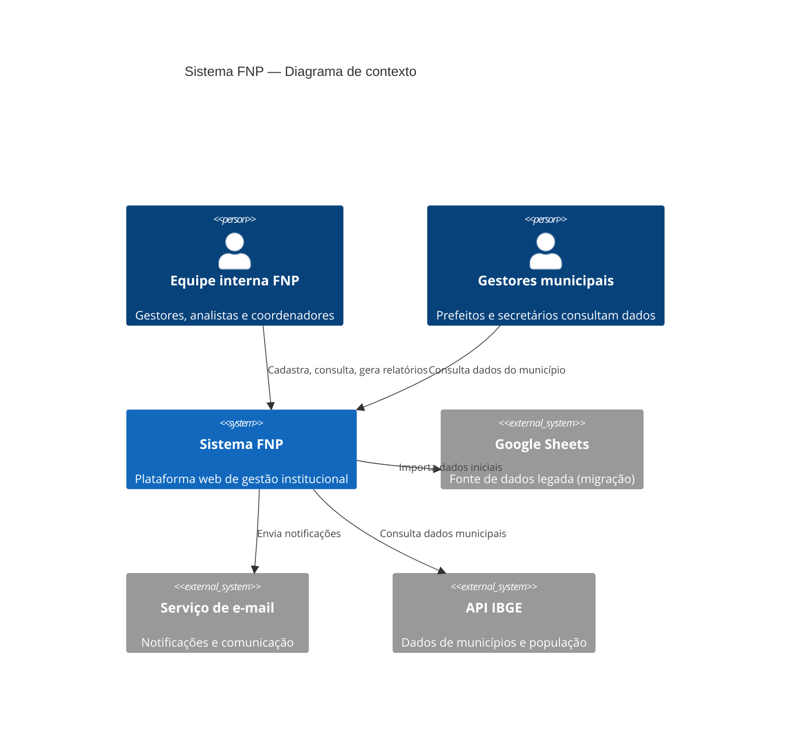
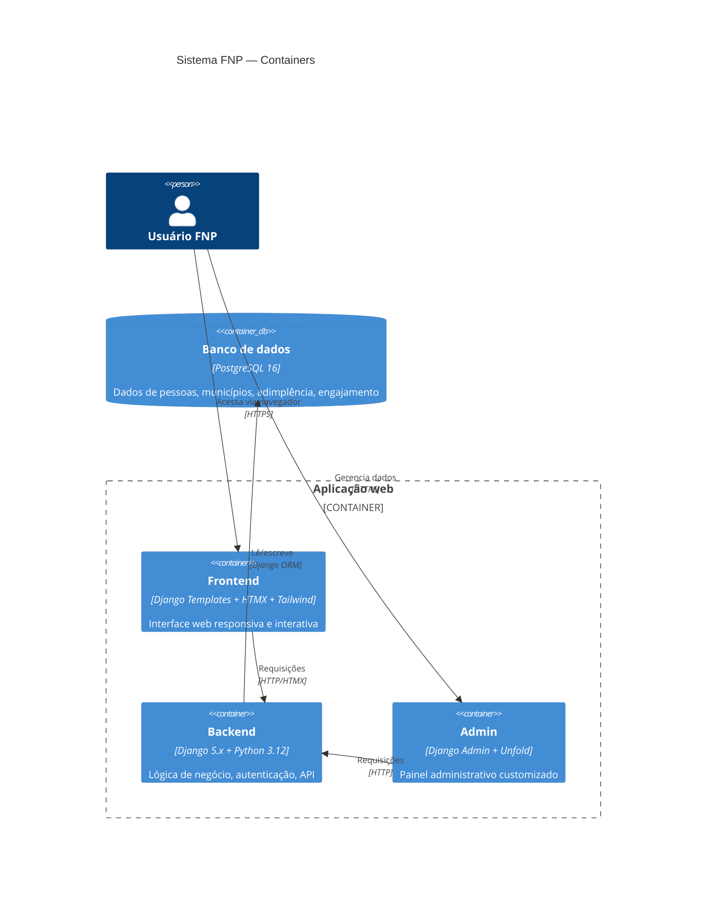
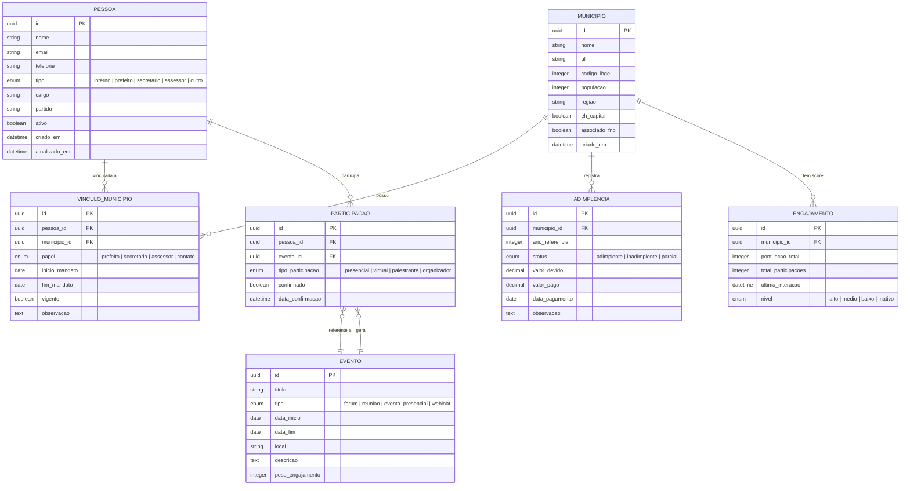
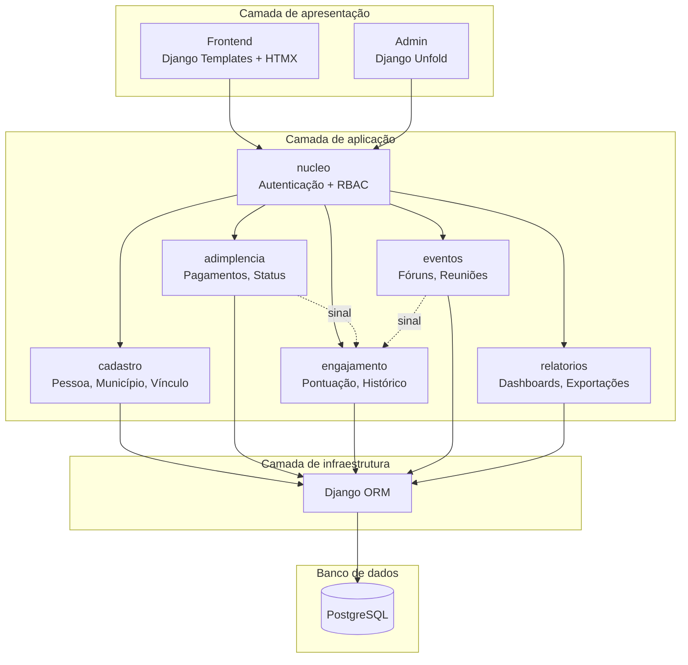
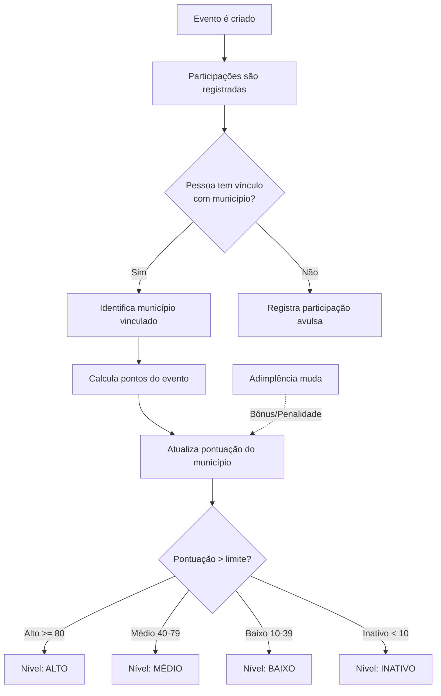

# Sistema FNP — Documentação de Arquitetura

> **Versão:** 1.0.0  
> **Data:** 2026-03-24  
> **Autor:** Equipe de Tecnologia — FNP  
> **Status:** Em construção

---

## 1. Visão geral

O Sistema FNP é a plataforma unificada de gestão institucional da Frente Nacional de Prefeitos. Centraliza o cadastro de pessoas (equipe interna, prefeitos, secretários, assessores), municípios associados, controle de adimplência, acompanhamento de engajamento e gestão de eventos.

### Objetivos

- Substituir planilhas Google Sheets por um sistema web integrado
- Centralizar dados de pessoas, municípios e relacionamentos em um único lugar
- Controlar adimplência dos municípios associados
- Medir e acompanhar o engajamento institucional
- Registrar participações em fóruns, reuniões e eventos
- Oferecer dashboards e relatórios para tomada de decisão

### Convenção de nomenclatura

| Escopo | Idioma | Exemplos |
|--------|--------|----------|
| Apps, models, campos, URLs, templates, pastas, commits, branches | **PT-BR** | `cadastro/`, `Pessoa`, `nome`, `lista_pessoas.html` |
| Arquivos técnicos do Django | **Inglês (padrão do framework)** | `models.py`, `views.py`, `urls.py`, `admin.py`, `manage.py` |

---

## 2. Diagrama de contexto (C4 — Nível 1)

Visão de alto nível: quem usa o sistema e com o que ele se integra.



---

## 3. Diagrama de containers (C4 — Nível 2)

Componentes técnicos do sistema e como se comunicam.



---

## 4. Modelo de domínio (ERD)

Entidades principais e seus relacionamentos.



---

## 5. Arquitetura de módulos (Django apps)

Cada módulo é um Django app independente com responsabilidades bem definidas.



---

## 6. Fluxo de engajamento

Como a pontuação de engajamento de um município é calculada e atualizada.



---

## 7. Stack tecnológica

| Camada | Tecnologia | Justificativa |
|--------|-----------|---------------|
| **Linguagem** | Python 3.12 | Conhecimento existente na equipe, ecossistema maduro |
| **Framework** | Django 5.x | Batteries-included, ORM poderoso, Admin, segurança |
| **Banco de dados** | PostgreSQL 16 | Robustez, escalabilidade, extensões (busca textual) |
| **Frontend** | Django Templates + HTMX + Tailwind CSS + Alpine.js | Interatividade sem complexidade de SPA |
| **Admin** | Django Unfold | Visual moderno para o Django Admin |
| **Deploy** | Ambiente local + GitHub | Cada dev clona, cria venv e roda |
| **CI/CD** | GitHub Actions | Testes, lint, deploy automático |
| **Diagramas** | Mermaid.js | Versionáveis no Git, renderizam no GitHub |

---

## 8. Decisões de arquitetura (RDAs)

As decisões arquiteturais são documentadas em arquivos separados na pasta `decisoes/`:

- [RDA-001: Usar Django ao invés de Next.js](decisoes/001-usar-django.md)
- [RDA-002: PostgreSQL ao invés de Google Sheets](decisoes/002-postgres-ao-inves-de-planilhas.md)
- [RDA-003: HTMX ao invés de React/SPA](decisoes/003-htmx-ao-inves-de-react.md)
- [RDA-004: Mermaid.js para diagramas versionáveis](decisoes/004-mermaid-para-diagramas.md)

---

## 9. Roteiro de implementação

| Fase | Prazo | Escopo |
|------|-------|--------|
| **Fase 1 — Fundação** | Semanas 1-2 | Setup projeto, models base, Django Admin, migração planilhas |
| **Fase 2 — Cadastro** | Semanas 3-4 | Interface de cadastro (pessoa, município, vínculo), busca, filtros |
| **Fase 3 — Adimplência** | Semanas 5-6 | Registro de pagamentos, status, histórico, alertas |
| **Fase 4 — Engajamento** | Semanas 7-8 | Pontuação automática, eventos, participações, dashboard |
| **Fase 5 — Relatórios** | Semanas 9-10 | Dashboards, exportações PDF/Excel, visão gerencial |
| **Fase 6 — Refinamento** | Semanas 11-12 | Testes, performance, feedback da equipe, deploy produção |

---

## 10. Estrutura do repositório

```
sistema-fnp/
├── documentacao/
│   └── arquitetura/
│       ├── LEIAME.md                      # Este arquivo
│       └── decisoes/                      # RDAs
├── configuracao/                          # Settings do Django
│   ├── __init__.py
│   ├── base.py
│   ├── local.py
│   └── producao.py
├── aplicacoes/
│   ├── nucleo/                            # Mixins, modelo base, autenticação
│   ├── cadastro/                          # Pessoa, Município, Vínculo
│   ├── adimplencia/                       # Pagamentos, status
│   ├── engajamento/                       # Pontuação, histórico
│   ├── eventos/                           # Fóruns, reuniões
│   └── relatorios/                        # Dashboards, exportações
├── templates/
│   ├── base.html
│   └── componentes/                       # Componentes HTMX reutilizáveis
├── estaticos/
│   ├── css/
│   └── js/
├── requisitos/
│   ├── base.txt
│   ├── local.txt
│   └── producao.txt
├── .env.exemplo                           # Variáveis de ambiente (modelo)
├── .gitignore
├── manage.py
└── LEIAME.md
```
