# Sistema FNP — Modelo de Dados v2

> **Data:** 2026-03-25
> **Status:** Em validação com a equipe

---

## 1. Modelo Relacional (ERD)

```mermaid
erDiagram
    PESSOA ||--o{ VINCULO_MUNICIPIO : "vinculada a"
    MUNICIPIO ||--o{ VINCULO_MUNICIPIO : "possui"
    MUNICIPIO ||--o{ ADIMPLENCIA : "registra"
    MUNICIPIO ||--|| ENGAJAMENTO : "tem score"
    EVENTO ||--o{ PARTICIPACAO : "gera"
    PESSOA ||--o{ PARTICIPACAO : "participa"
    PESSOA ||--o{ ENVOLVIMENTO_PAUTA : "defende"
    PAUTA ||--o{ ENVOLVIMENTO_PAUTA : "envolve"
    MUNICIPIO ||--o{ PARTICIPACAO : "pontua via pessoa"

    PESSOA {
        uuid id PK
        string nome
        string email
        string telefone
        image foto
        string cargo
        string partido
        enum tipo "interno | prefeito | vice_prefeito | secretario | assessor | vereador | outro"
        enum genero "masculino | feminino | outro | nao_informado"
        string redes_sociais
        text biografia_curta
        text observacoes
        date mandato_inicio
        date mandato_fim
        boolean ativo
        datetime criado_em
        datetime atualizado_em
    }

    MUNICIPIO {
        uuid id PK
        string nome
        string uf
        integer codigo_ibge
        integer populacao
        enum regiao "norte | nordeste | centro_oeste | sudeste | sul"
        boolean eh_capital
        boolean associado_fnp
        decimal latitude
        decimal longitude
        datetime criado_em
        datetime atualizado_em
    }

    VINCULO_MUNICIPIO {
        uuid id PK
        uuid pessoa_id FK
        uuid municipio_id FK
        enum papel "prefeito | vice_prefeito | secretario | assessor | vereador | contato"
        date inicio_mandato
        date fim_mandato
        boolean vigente
        text observacao
        datetime criado_em
    }

    PAUTA {
        uuid id PK
        string nome
        string descricao
        string icone
        boolean ativa
    }

    ENVOLVIMENTO_PAUTA {
        uuid id PK
        uuid pessoa_id FK
        uuid pauta_id FK
        enum nivel "apoiador | engajado | lider"
        text observacao
    }

    EVENTO {
        uuid id PK
        string titulo
        enum tipo "reuniao_geral | forum | congresso | viagem_internacional | viagem_nacional | reuniao_presencial | reuniao_online | webinar | presenca_fnp"
        enum modalidade "presencial | online | hibrido"
        date data_inicio
        date data_fim
        string local
        text descricao
        integer pontos_presencial
        integer pontos_online
        integer pontos_palestrante_bonus
        integer pontos_organizador_bonus
        datetime criado_em
    }

    PARTICIPACAO {
        uuid id PK
        uuid pessoa_id FK
        uuid evento_id FK
        uuid municipio_id FK "município que recebe os pontos"
        enum forma_participacao "presencial | online"
        enum papel_no_evento "participante | palestrante | organizador | moderador"
        boolean confirmado
        integer pontos_calculados
        datetime data_confirmacao
        datetime criado_em
    }

    ADIMPLENCIA {
        uuid id PK
        uuid municipio_id FK
        integer ano_referencia
        enum status "adimplente | inadimplente | parcial"
        decimal valor_devido
        decimal valor_pago
        date data_pagamento
        text observacao
        datetime criado_em
    }

    ENGAJAMENTO {
        uuid id PK
        uuid municipio_id FK
        string bienio "ex: 2025-2026"
        integer pontuacao_bruta "soma de todos os pontos"
        integer pontuacao_normalizada "0 a 100"
        integer total_participacoes
        integer penalidade_adimplencia "pontos perdidos"
        enum nivel "alto | medio | baixo | inativo"
        datetime ultima_atualizacao
    }
```



---

## 2. Sistema de Pontuação

### 2.1 Pontos por tipo de evento

| Tipo de Evento | Presencial | Online | Palestrante (+) | Organizador (+) |
|----------------|-----------|--------|-----------------|-----------------|
| **Reunião Geral da FNP** | 20 | 12 | +5 | +5 |
| **Fórum** | 15 | 9 | +5 | +5 |
| **Congresso** | 15 | 9 | +5 | +5 |
| **Viagem internacional** | 12 | — | +3 | +3 |
| **Viagem nacional** | 10 | — | +3 | +3 |
| **Reunião presencial na FNP** | 8 | — | +3 | +3 |
| **Reunião online** | — | 5 | +2 | +2 |
| **Webinar** | — | 3 | +2 | +2 |
| **Presença na FNP** (visita) | 2 | — | — | — |

### 2.2 Penalidade por inadimplência

| Status Adimplência | Penalidade |
|--------------------|-----------|
| **Adimplente** | 0% (sem penalidade) |
| **Parcial** | -15% da pontuação bruta |
| **Inadimplente** | -30% da pontuação bruta |

### 2.3 Decaimento estilo ranking (ATP/Tênis)

Pontos não somem de uma vez — decaem gradualmente se o município não mantém atividade.

```
FATOR_DECAIMENTO = 0.70  (configurável)

Para cada participação:
  - Ano atual → vale 100% dos pontos
  - Ano anterior → vale 70% dos pontos (decai 30%)

pontuacao_bruta = pontos_ano_atual + (pontos_ano_anterior × FATOR_DECAIMENTO)
```

**Exemplo prático:**
- Município X participou de 5 eventos em 2025 (total: 60 pts)
- Em 2026, participou de 3 eventos (total: 35 pts)
- Pontuação bruta 2026 = 35 + (60 × 0.70) = 35 + 42 = **77 pontos**
- Se não tivesse participado de nada em 2026: 0 + (60 × 0.70) = **42 pontos** (caiu, mas não zerou)

### 2.4 Penalidade por inadimplência + cálculo final

```
penalidade = pontuacao_bruta × percentual_inadimplencia
pontuacao_liquida = pontuacao_bruta - penalidade

pontuacao_normalizada = min(100, (pontuacao_liquida / META_BIENIO) × 100)
```

**META_BIENIO** = pontuação de referência para atingir 100 (ex: 200 pontos).
Configurável pela equipe FNP — um município que atingir 200 pontos brutos no biênio terá nota 100.

### 2.5 Níveis de engajamento

| Nível | Faixa (0–100) | Cor |
|-------|---------------|-----|
| **Alto** | 70 – 100 | Verde |
| **Médio** | 40 – 69 | Azul |
| **Baixo** | 10 – 39 | Amarelo |
| **Inativo** | 0 – 9 | Cinza |

---

## 3. Matriz de Atenção (Adimplência × Engajamento)

Cruzamento estratégico para a equipe FNP agir proativamente:

```
                    ENGAJAMENTO
                 Alto          Baixo
              ┌────────────┬────────────┐
  Adimplente  │  IDEAL     │  RISCO DE  │
              │            │  ABANDONO  │
              │  Manter    │  Engajar   │
 ADIMPLÊNCIA  ├────────────┼────────────┤
              │ OPORTUNIDADE│  CRÍTICO   │
 Inadimplente │  DE COBRAR │            │
              │  Converter │  Resgatar  │
              └────────────┴────────────┘
```

| Quadrante | Perfil | Ação da FNP |
|-----------|--------|-------------|
| **Ideal** (adimplente + engajado) | Município modelo | Manter relacionamento, usar como exemplo |
| **Risco de abandono** (adimplente + baixo engajamento) | Paga mas não participa | Convidar para eventos, dar atenção pessoal |
| **Oportunidade** (inadimplente + engajado) | Participa mas não paga | Abordar para regularizar — já tem vínculo |
| **Crítico** (inadimplente + desengajado) | Sem vínculo nenhum | Ação de resgate prioritária |

---

## 4. Regras de negócio

1. **Quem pontua:** a pessoa participa, mas os pontos vão para o município vinculado (campo `municipio_id` em Participação)
2. **Pessoa com múltiplos vínculos:** ao registrar participação, define-se qual município recebe os pontos
3. **Biênio:** a pontuação reseta a cada troca de diretoria (ex: 2025-2026, 2027-2028). Histórico é mantido.
4. **Recálculo:** o score do município é recalculado automaticamente via signal ao registrar participação ou alterar adimplência
5. **Meta do biênio:** configurável no admin (padrão: 200 pontos = nota 100)
